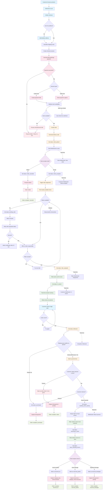

```mermaid
  flowchart TD
      %% Customer Journey Start
      A[Customer browses products] --> B[Add items to cart]
      B --> C[Initiate checkout]

      %% Checkout Process
      C --> D{User has address?}
      D -->|No| E[Add/validate address]
      D -->|Yes| F[Calculate shipping costs]
      E --> F
      F --> G[Create checkout session]
      G --> H[Generate MercadoPago payment]

      %% Payment Processing
      H --> I{Payment successful?}
      I -->|No| J[Payment failed - Return to cart]
      I -->|Yes| K{Payment type?}
      K -->|Credit Card| L[Create payment hold]
      K -->|Debit Card| M[Direct payment capture]

      %% Stock Validation
      L --> N[Validate stock availability]
      M --> N
      N --> O{Stock available?}
      O -->|No| P[Process refund/cancel hold]
      O -->|Yes| Q[Create order]

      %% Order Creation
      Q --> R[Generate delivery code]
      R --> S[Set status: order_placed]
      S --> T[Send WebSocket to store]
      P --> J

      %% Store Response
      T --> U{Store accepts order?}
      U -->|Reject| V[Set status: order_canceled]
      U -->|Accept| W[Set status: order_accepted]
      V --> X[Process refund]
      X --> Y[Order ended]

      %% Rider Assignment
      W --> Z[Trigger rider assignment]
      Z --> AA[Find nearby available riders]
      AA --> BB{Riders available?}
      BB -->|No| CC[Set status: pending_rider]
      BB -->|Yes| DD[Offer to riders sequentially]

      %% Rider Assignment Fallback
      CC --> EE[Wait 5 minutes]
      EE --> FF[Retry with expanded radius]
      FF --> GG{Success?}
      GG -->|No| HH[Admin notification after 10 min]
      GG -->|Yes| DD

      %% Rider Accepts
      DD --> II{Rider accepts?}
      II -->|No| JJ[Try next rider]
      II -->|Yes| KK[Set status: rider_assigned]
      JJ --> BB

      %% Delivery Process
      KK --> LL[Rider picks up from store]
      LL --> MM[Set status: in_transit]
      MM --> NN[Real-time location tracking]
      NN --> OO[Rider arrives at customer]
      OO --> PP[Customer enters 6-digit code]
      PP --> QQ{Code correct?}
      QQ -->|No| RR[Try again]
      QQ -->|Yes| SS[Set status: delivered]
      RR --> PP

      %% Try Period Decision
      SS --> TT{Shipping type enables try period?}
      TT -->|Simple: No| UU[Set status: purchased]
      TT -->|Advanced/Premium: Yes| VV[Start try period timer]

      %% Try Period Flow
      VV --> WW{Customer makes decision in time?}
      WW -->|Timeout| XX[Mark as stolen after 15 min grace]
      WW -->|Yes| YY{Customer decision?}

      %% Customer Decisions
      YY -->|Keep all| UU
      YY -->|Return some/all| ZZ[Set status: awaiting_return_pickup]

      %% Return Pickup Process
      ZZ --> AAA[Assign rider for return pickup]
      AAA --> BBB[Rider collects returns from customer]
      BBB --> CCC[Set status: returning_to_store]
      CCC --> DDD[Rider delivers returns to store]
      DDD --> EEE[Set status: store_checking_returns]

      %% Store Return Inspection
      EEE --> FFF{Store inspects returns}
      FFF -->|Good condition| GGG[Mark as returned_ok]
      FFF -->|Some damage| HHH[Mark as returned_partial]
      FFF -->|Significant damage| III[Mark as returned_damaged]

      %% Payment Settlement
      UU --> JJJ[Capture full payment]
      XX --> KKK[Capture full payment + penalty]
      GGG --> LLL[Capture shipping only, refund products]
      HHH --> MMM[Capture kept items + shipping, refund returned]
      III --> NNN[Capture full payment + penalty]

      %% Final States
      JJJ --> OOO[Order complete: purchased]
      KKK --> PPP[Order complete: stolen]
      LLL --> QQQ[Order complete: returned_ok]
      MMM --> RRR[Order complete: returned_partial]
      NNN --> SSS[Order complete: returned_damaged]
      Y --> TTT[Order complete: canceled]

      %% WebSocket Notifications (parallel)
      T -.->|Real-time| WSSTORE[Store WebSocket: New order]
      W -.->|Real-time| WSCUST1[Customer WebSocket: Order accepted]
      KK -.->|Real-time| WSRIDER[Rider WebSocket: Assignment]
      MM -.->|Real-time| WSCUST2[Customer WebSocket: In transit]
      SS -.->|Real-time| WSALL[All parties: Delivered]
      ZZ -.->|Real-time| WSRETURN[WebSocket: Return process]

      %% Error Handling (dotted lines)
      BB -.->|Fallback| HHH2[Manual admin intervention]
      N -.->|Stock sync failure| AUTO[Auto-refund via webhook]

      %% Styling
      classDef customerAction fill:#e1f5fe
      classDef storeAction fill:#f3e5f5
      classDef riderAction fill:#e8f5e8
      classDef systemAction fill:#fff3e0
      classDef paymentAction fill:#fce4ec
      classDef finalState fill:#f1f8e9
      classDef errorState fill:#ffebee

      class A,B,C,E,PP customerAction
      class U,FFF storeAction
      class LL,MM,NN,OO,BBB,DDD riderAction
      class Q,R,S,Z,AA,KK,SS,VV systemAction
      class H,I,L,M,X,JJJ,KKK,LLL,MMM,NNN paymentAction
      class OOO,PPP,QQQ,RRR,SSS,TTT finalState
      class J,P,Y,XX errorState
```

